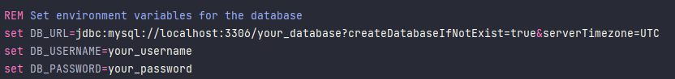

# MS-Products

## Table of Contents:

1. [General Info](#general-info)
2. [Technologies](#technologies)
3. [Prerequisites](#prerequisites)
4. [Installation and Configuration](#installation-and-configuration)
5. [Running the Application](#running-the-application)
6. [Docker Stack](#docker-stack)
7. [Test](#test)
8. [API Documentation](#api-documentation)
9. [Contact](#contact)

## General Info

***
MS-Products is a project based on a microservices architecture implemented with Spring 6 and Spring Boot 3.4.1, following a Spring module structure. The project includes a configuration server responsible for storing and distributing the configuration files for each microservice.

The security of the application is based on authentication via OAuth2 tokens, which led to the creation of the following services:

- **LDAP Server**: A server that stores user information.
- **Auth Server**: An OAuth2-based authorization server responsible for authenticating and authorizing users.
- **Products API**: A resource server and client based on OAuth2, simulating the authentication and authorization process in a real enterprise environment.

The authentication and authorization flow works as follows:

1. Users are registered in an LDAP directory.
2. The authorization server queries the LDAP server to verify if the user exists.
3. If the user is found, the LDAP server returns a code to the authorization server.
4. The authorization server sends this code to the LDAP server to obtain an encrypted token with the necessary information to authenticate the user.
5. The authorization server exposes this token to the resource server (Products API), allowing the user to access protected resources.

This design simulates a real enterprise environment where authentication and authorization are managed centrally and securely.

## Technologies

A list of technologies used within the project:

- **Spring Framework 6 and Spring Boot 3.4.1**: Frameworks for building Java applications quickly and efficiently with support for microservices architecture.
- **Spring Security**: Provides comprehensive security services, including authentication and authorization. Includes OAuth2 server, resource server, and client components to handle OAuth2 authentication and authorization flows.
- **Spring Security LDAP**: A module of Spring Security for integrating LDAP authentication and authorization into Spring applications. Used for authenticating users through an LDAP server.
- **Spring OAuth2**: Specifically used for implementing OAuth2-based security features. Includes OAuth2 Authorization Server (Auth Server), OAuth2 Resource Server (Products API), and OAuth2 Client for handling secure resource access.
- **Spring Data JPA**: For data persistence using the Java Persistence API (JPA) to interact with relational databases.
- **Spring Cloud**: Used for the configuration server, enabling centralized configuration management across microservices in the system.
- **MapStruct**: A tool for mapping between DTOs (Data Transfer Objects) and entities to reduce boilerplate code and improve performance.
- **H2 Database**: An in-memory database used for testing purposes to simulate production-like environments in local setups.
- **MySQL**: A relational database used for storing persistent data in the production environment.
- **SpringDoc OpenAPI**: Automatically generates OpenAPI specifications and API documentation from code annotations.
- **JUnit and Mockito**: JUnit for unit testing, and Mockito for mocking dependencies to test components in isolation.
- **LDAP**: A directory service protocol used for storing and managing user data in the authentication process (LDAP Server).


## Prerequisites

***
Before you begin, ensure you have met the following prerequisites:

* JDK 21 or higher installed.
* Maven 3.6+ installed.
* You have MySQL running.
* Docker and Docker Compose installed(if you prefer to run the application with Docker).
* **Spring Boot 3.4.1** must be used for compatibility. (update the version in `pom.xml`)

## Installation and Configuration

***

1. **Clone the repository**:
    ```bash
    git clone https://github.com/jmarqb/ms-products.git
    cd ms-products
    ```
2. **Verify if you are using the Spring Boot version (3.4.1) in `pom.xml`**:
   - In `pom.xml`, check that the version of Spring Boot is set as follows:
    ```xml
    <parent>
        <groupId>org.springframework.boot</groupId>
        <artifactId>spring-boot-starter-parent</artifactId>
        <version>3.4.1</version> <!-- Ensure this version is 3.4.1 -->
        <relativePath />
    </parent>
    ```

## Running the Application

***
There are two ways to run the application:
Build and run with Maven or Build and run with Docker.

1. **Build and run with Maven**:

- Open the corresponding script (start.sh for Unix/Linux or start.bat for Windows) with text editor and replace 

with your database and mySQL  user credentials.

- Save the file and close it. Then, run the script:
### For Unix/Linux systems:

```bash
chmod +x start.sh
./start.sh
```

### For PowerShell (Windows):

```bash
.\start.bat
```

2. **Steps to Obtain the OAuth2 Token**:

- **Start the application servers**:
  Make sure that all the required servers are running (Config Server, LDAP Server, Auth Server, and Products API). You can use the corresponding scripts (start.sh for Unix/Linux or start.bat for Windows) to start the servers.

- **Access the Authorization URL**:
  Once the servers are running, open your browser and navigate to http://localhost:8080/oauth2/authorization/auth-api ,this will redirect you to the login page.

- **Login to the system**:
  You will be redirected to the login page hosted on the LDAP server (`http://localhost:9000/login`). Enter username and password. The username and password for user with manager role are ( `ben` and `ben`)

- **Obtain the token**:
  Once you have logged in, the OAuth2 token will be generated and displayed on the screen. Copy the token and use it in the subsequent requests to access protected resources (Products API).

3. **Access the application documentation**:
   The application documentation will be accessible at http://localhost:8080/swagger-ui/index.html (or any port specified in your `application.yml` file).

## Docker Stack

If you have Docker and Docker Compose installed, running the application becomes even easier. First, clone the
repository and navigate to the project directory:
To run the application using Docker:

```bash
git clone https://github.com/jmarqb/ms-products.git
cd ms-products
mvn clean install
```

**Build and run with Docker**:

- **Modify the hosts file (if you're on Windows)**: Before running docker-compose, you may need to modify the hosts file to ensure the application can resolve the names of the containers properly.

- Open the hosts file (Windows): `C:\Windows\System32\drivers\etc\hosts`
- Add the following line at the end of the file:
  `127.0.0.1 auth-server`
  `127.0.0.1 products-api`

- To build the Docker image and start the application, use the following command:

```bash
docker-compose up --build
```

This will set up and start both the application and necessary services like the database.

1. **Access the application**:
- **Access the Authorization URL**:
  Once the containers are running, open your browser and navigate to http://localhost:8080/oauth2/authorization/auth-api ,this will redirect you to the login page.

- **Login to the system**:
  You will be redirected to the login page hosted on the LDAP server (`http://auth-server:9000/login`). Enter username and password. The username and password for user with manager role are ( `ben` and `ben`)

- **Obtain the token**:
  Once you have logged in, the OAuth2 token will be generated and displayed on the screen. Copy the token and use it in the subsequent requests to access protected resources (Products API).

3. **Access the application documentation**:
   The application documentation will be accessible at http://localhost:8080/swagger-ui/index.html (or any port specified in your `application.yml` file).

2. **Stop the containers**:
   To stop the running containers, use:
    ```bash
    docker-compose down
    ```

## Test

To ensure everything runs smoothly, this project includes both Unit and Integration tests using the tools JUnit and Mockito.
To execute them, follow these steps:

Dependency Installation: Before running the tests, ensure you've installed all the project dependencies. If you haven't done so yet, you can install them by executing the command `mvn clean install`.

To run the tests on controllers and services, and verify the complete flow and functioning of the application use the following command:

```bash
$ mvn test
```
It's important to highlight that these e2e tests utilize a H2 database for testing.

## API Documentation

You can access the API documentation at `localhost:<port>/swagger-ui/index.html` or `localhost:<port>/v3/api-docs`.

For more detailed information about the endpoints, responses, and status codes, visit the API documentation.

---

## Contact

Thank you for checking out my project! If you have any questions, feedback, or just want to connect, here's where you
can find me:

**GitHub**: [jmarqb](https://github.com/jmarqb)

Feel free to [open an issue](https://github.com/jmarqb/ms-auth/issues) or submit a PR if you find any bugs or have some
suggestions for improvements.

© 2025 Jacmel Márquez. All rights reserved.
